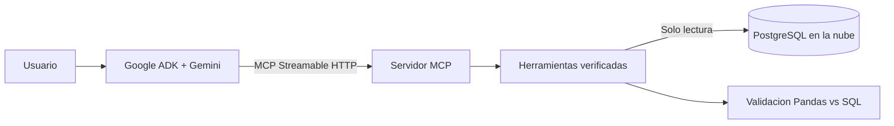

# Agente conversacional de analisis de ventas

Esta implementacion adapta el ejemplo de `datos.gob.es` proporcionado por el auxiliar al conjunto de ventas del proyecto. El agente usa Google ADK y Gemini para interpretar preguntas, pero todos los datos y calculos provienen de herramientas controladas del servidor MCP.

## Alcance actual

El chat puede responder los incisos implementados:

- **2.a:** origen, dimensiones, columnas, tipos, rango de fechas y validaciones de los datos obtenidos desde PostgreSQL.
- **2.b:** media, mediana, moda, frecuencia de la moda y comprobacion independiente con PostgreSQL.
- Muestras de entre 1 y 20 filas de `clientes` o `compras`.

No se expone una herramienta de SQL arbitrario. Los analisis de tendencias, segmentacion, correlacion y visualizaciones se agregaran como herramientas especificas cuando sus calculos manuales esten validados.

## Arquitectura



El agente y el servidor MCP se ejecutan como procesos separados:

| Componente | Archivo | Direccion predeterminada |
|---|---|---|
| Servidor MCP | `mcp_server.py` | `http://127.0.0.1:8000/mcp` |
| Agente ADK | `main.py` | `http://127.0.0.1:8080` |

## Herramientas MCP

| Herramienta | Funcion |
|---|---|
| `obtener_resumen_datos` | Consulta dimensiones, columnas, tipos y validaciones de PostgreSQL. |
| `obtener_estadisticas_basicas` | Calcula media, mediana y moda y confirma los resultados con SQL. |
| `obtener_muestra_datos` | Devuelve una muestra acotada de `clientes` o `compras`. |

Las tres herramientas reutilizan `analisis_exploratorio.py`, que trabaja en una transaccion `REPEATABLE READ` de solo lectura.

## Configuracion

El archivo real es `Practica_1/.env` y se encuentra ignorado por Git. `Practica_1/.env.example` documenta todas las variables sin contener secretos.

La variable que debe completar el estudiante es:

```dotenv
GOOGLE_API_KEY=tu_clave_de_Google_AI_Studio
```

La clave puede obtenerse en [Google AI Studio](https://aistudio.google.com/app/apikey). No debe escribirse en notebooks, capturas, commits ni archivos de resultados.

Configuracion predeterminada:

```dotenv
GEMINI_MODEL=gemini-3.5-flash-lite
MCP_HOST=127.0.0.1
MCP_PORT=8000
MCP_SERVER_URL=http://127.0.0.1:8000/mcp
MCP_TIMEOUT_SECONDS=60
AGENT_HOST=127.0.0.1
AGENT_PORT=8080
ADK_SESSION_DB_PATH=sessions.db
```

## Instalacion

Desde `Practica_1/02-Analisis-exploratorio`:

```powershell
python -m pip install -r requirements.txt
```

Las versiones centrales se fijaron para evitar las incompatibilidades presentes en el notebook de referencia:

```text
google-adk[mcp]==2.7.1
mcp==1.29.0
```

## Ejecucion

La VM de PostgreSQL debe estar encendida. Se necesitan dos terminales abiertas en `Practica_1/02-Analisis-exploratorio`.

Terminal 1, servidor MCP:

```powershell
python mcp_server.py
```

Terminal 2, agente ADK:

```powershell
python main.py
```

Abrir en el navegador:

```text
http://127.0.0.1:8080
```

En la interfaz se selecciona `ventas_agent` y se inicia una conversacion. El endpoint `/mcp` no es una pagina web normal; una solicitud GET directa puede devolver un error porque requiere el protocolo MCP.

## Preguntas de prueba

```text
Obten los datos desde la base y explicame cuantas filas y columnas tiene cada tabla.
```

```text
Calcula la media, mediana y moda de todas las variables numericas.
```

```text
Muestrame tres registros de ejemplo de la tabla compras.
```

```text
Que variables fueron excluidas de las estadisticas y por que?
```

Las respuestas estadisticas deben coincidir con `resultados/estadisticas_basicas.csv`.

## Pruebas

Suite completa:

```powershell
python -m pytest -v
```

Prueba especifica del protocolo MCP y la aplicacion ADK:

```powershell
python -m pytest -v tests/test_mcp_protocolo.py
```

La prueba de protocolo levanta temporalmente el servidor, descubre las tres herramientas mediante Streamable HTTP e invoca `obtener_estadisticas_basicas` contra PostgreSQL.

## Seguridad y limitaciones

- La base de datos se consulta en modo de solo lectura.
- El modelo nunca recibe las credenciales de PostgreSQL ni la clave de Gemini.
- El MCP escucha solamente en `127.0.0.1` de forma predeterminada.
- El servidor rechaza direcciones no locales mientras no exista autenticacion MCP.
- No existe una herramienta para ejecutar SQL proporcionado por el usuario o el modelo.
- La interfaz `web=True` de ADK es apropiada para desarrollo y demostracion, no para produccion publica.
- Las sesiones se almacenan en `sessions.db`, archivo local ignorado por Git.
- Una prueba completa de conversacion con Gemini consume cuota y requiere `GOOGLE_API_KEY` valida.
