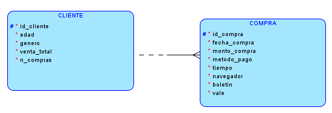
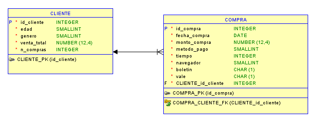

# Informe de avance - Practica 1

**Universidad de San Carlos de Guatemala**  
**Facultad de Ingenieria - Escuela de Ciencias y Sistemas**  
**Sistemas Organizacionales y Gerenciales 2 - Segundo Semestre 2026**  
**Grupo 8**

## 1. Presentacion

La empresa analizada realizo ventas en linea durante 2021 y desea evaluar su expansion hacia una sucursal fisica. Para facilitar el acceso a la informacion, el proyecto tambien contempla un agente conversacional que entregue resultados respaldados por los datos almacenados.

El archivo fuente [`Venta_online_c.csv`](../Enunciado/Venta_online_c.csv) contiene 6,500 registros y 12 columnas: identificador del cliente, edad, genero, venta total, numero de compras, fecha, monto de compra, metodo de pago, tiempo, navegador, boletin y vale.

## 2. Planificacion

### Division inicial

| Fase | Alcance | Estado |
|---|---|---|
| Preparacion y base de datos | Punto 1.a al 1.d | Completado |
| Analisis exploratorio inicial | Punto 2.a y 2.b | Completado |
| Visualizaciones y tendencias | Punto 2.c y punto 3 | Pendiente |
| Segmentacion y correlaciones | Puntos 4 y 5 | Pendiente |
| Graficos, conclusiones y respuestas | Puntos 6, 7 y 8 | Pendiente |
| Integracion final del agente e informe PDF | Entregable final | En progreso |

### Herramientas seleccionadas

| Herramienta | Uso | Motivo |
|---|---|---|
| Python y Pandas | Limpieza y analisis | Permiten validar y transformar datos de forma reproducible. |
| PostgreSQL 16 | Base de datos relacional | Aporta tipos adecuados, restricciones e integridad referencial. |
| AWS EC2 y Docker | Despliegue en la nube | Permiten alojar PostgreSQL en un entorno accesible por el equipo. |
| SQLAlchemy y psycopg2 | Conexion desde Python | Evitan concatenar credenciales o consultas manualmente. |
| Google Colab/Jupyter | Ejecucion de notebooks | Facilitan la revision del proceso celda por celda. |
| Google ADK y MCP | Agente conversacional | Son requisitos tecnicos del enunciado y separan la IA de los calculos. |
| GitHub | Colaboracion | Centraliza codigo, documentacion y control de versiones. |

## 3. Base de datos relacional en la nube

### Diseño conceptual

El modelo separa la informacion en dos entidades. `CLIENTE` conserva los atributos demograficos y acumulados anuales; `COMPRA` representa el registro puntual asociado al cliente.

*Figura 1. Modelo conceptual elaborado para la practica.*

### Diseño logico

La relacion entre `CLIENTE` y `COMPRA` es de uno a muchos. La clave foranea permite incorporar mas compras por cliente sin repetir sus datos demograficos.

*Figura 2. Modelo logico con claves primaria y foranea.*

Estos son los unicos diagramas incluidos en este avance porque documentan directamente el diseño solicitado para la base de datos.

### Diccionario de datos

#### Tabla `clientes`

| Columna | Tipo SQL | Restricciones | Descripcion |
|---|---|---|---|
| `id_cliente` | `INTEGER` | PK | Identificador unico. |
| `edad` | `SMALLINT` | `NOT NULL`, rango valido | Edad del cliente. |
| `genero` | `SMALLINT` | `0` o `1` | 0 masculino, 1 femenino. |
| `venta_total` | `NUMERIC(12,4)` | No negativo | Venta anual acumulada. |
| `n_compras` | `INTEGER` | Mayor que 0 | Numero anual de compras. |

#### Tabla `compras`

| Columna | Tipo SQL | Restricciones | Descripcion |
|---|---|---|---|
| `id_compra` | `SERIAL` | PK | Identificador de la compra. |
| `id_cliente` | `INTEGER` | FK a `clientes` | Cliente asociado. |
| `fecha_compra` | `DATE` | `NOT NULL` | Fecha de la compra. |
| `monto_compra` | `NUMERIC(12,4)` | No negativo | Monto puntual. |
| `metodo_pago` | `SMALLINT` | `0`, `1` o `2` | Efectivo, credito o debito. |
| `tiempo` | `INTEGER` | Mayor que 0 | Tiempo de sesion en segundos. |
| `navegador` | `SMALLINT` | Entre `0` y `4` | Tienda fisica o navegador. |
| `boletin` | `BOOLEAN` | `NOT NULL` | Uso de boletin. |
| `vale` | `BOOLEAN` | `NOT NULL` | Uso de vale. |

El DDL reproducible se encuentra en [`BD/schema.sql`](../BD/schema.sql).

### Implementacion en AWS

PostgreSQL 16 fue desplegado en un contenedor Docker dentro de una instancia AWS EC2. El esquema se creo mediante `schema.sql` y se verifico desde DBeaver.

*Figura 3. Instancia de AWS EC2 utilizada para alojar la base de datos.*

*Figura 4. PostgreSQL 16 ejecutandose mediante Docker.*

*Figura 5. Tablas `clientes` y `compras` creadas en PostgreSQL.*

## 4. Preparacion de datos

El proceso se implemento en [`ETL/etl.ipynb`](../ETL/etl.ipynb).

### 4.1 Extraccion

Pandas leyo el CSV usando punto y coma (`;`) como separador. La extraccion produjo 6,500 filas y 12 columnas.

*Figura 6. Extraccion completa del archivo fuente.*

### 4.2 Valores faltantes y duplicados

Las validaciones encontraron cero valores nulos, cero filas completamente duplicadas y cero identificadores de cliente repetidos. Por lo tanto, no fue necesario imputar datos ni eliminar registros.

*Figura 7. Resultado de la revision de valores faltantes.*

*Figura 8. Resultado de la revision de duplicados.*

Tambien se comprobaron los dominios de genero, metodo de pago, navegador, boletin y vale, además de los rangos numericos observados.

### 4.3 Tipos y transformaciones

Se aplicaron transformaciones deterministas:

- `FechaCompra` paso de texto `DD.MM.AA` a fecha real.
- Los identificadores, edades, conteos y codigos se convirtieron a enteros.
- `Boletin` y `Vale` se convirtieron a booleanos.
- `Venta_total` y `MontoCompra` se almacenaron como `NUMERIC(12,4)`.
- Los nombres de columnas se normalizaron a `snake_case`.

*Figura 9. Conversion y validacion de las fechas de 2021.*

### 4.4 Carga y verificacion

El conjunto se separo en `clientes` y `compras`. Antes de cargarlo se verifico que no existieran compras huerfanas. La carga incremental inserto 6,500 clientes y 6,500 compras y evita repetir clientes ya existentes al ejecutar nuevamente el proceso.

*Figura 10. Registros insertados por el pipeline ETL.*

*Figura 11. Verificacion posterior de conteos en PostgreSQL.*

## 5. Analisis exploratorio inicial

El codigo reutilizable esta en [`app/analisis/punto_02.py`](../app/analisis/punto_02.py) y su ejecucion guiada en [`02-Analisis-exploratorio/analisis_exploratorio.ipynb`](../02-Analisis-exploratorio/analisis_exploratorio.ipynb).

### 5.1 Obtencion desde la base de datos

Las tablas se consultaron por separado en una transaccion PostgreSQL `READ ONLY` con aislamiento `REPEATABLE READ`. Asi se obtiene una instantanea consistente y se evita modificar accidentalmente los datos.

*Figura 12. Obtencion de 6,500 clientes y 6,500 compras desde PostgreSQL.*

### 5.2 Seleccion de variables numericas

Se calcularon medidas para `edad`, `venta_total`, `n_compras`, `monto_compra` y `tiempo`. Se excluyeron identificadores y categorias codificadas porque calcular su media o mediana no tiene interpretacion de negocio.

### 5.3 Media, mediana y moda

| Variable | Unidad | Registros | Media | Mediana | Moda | Frecuencia de la moda |
|---|---|---:|---:|---:|---:|---:|
| Edad | Años | 6,500 | 36.305231 | 36.0000 | 18 | 465 |
| Venta total | Moneda | 6,500 | 206.242431 | 137.3500 | 98.0000 | 12 |
| Numero de compras | Compras | 6,500 | 5.090000 | 4.0000 | 2 | 1,044 |
| Monto de compra | Moneda | 6,500 | 39.787056 | 35.7640 | 37.1450 | 5 |
| Tiempo | Segundos | 6,500 | 767.376154 | 768.0000 | 852 | 24 |

*Figura 13. Estadisticas calculadas con Pandas.*

La venta total presenta una media mayor que la mediana, lo que indica influencia de clientes con ventas acumuladas altas. El numero de compras más frecuente es dos. En tiempo de sesión, media y mediana son muy cercanas.

### 5.4 Verificacion independiente

PostgreSQL recalculo la media con `AVG`, la mediana con `percentile_cont(0.5)` y la moda mediante frecuencias agrupadas. Los cinco resultados coincidieron con Pandas.

*Figura 14. Contraste independiente entre Pandas y PostgreSQL.*

## 6. Integracion conversacional disponible

La base del agente ya permite solicitar el resumen de datos, las estadisticas basicas y muestras limitadas. Google ADK se conecta al servidor MCP, y este invoca funciones deterministas que consultan PostgreSQL en modo de solo lectura. El modelo no recibe credenciales ni ejecuta SQL libre.

*Figura 15. Consulta de media, mediana y moda de edad desde el agente.*

## 7. Desafios y decisiones

| Situacion | Decision aplicada |
|---|---|
| El CSV usa un separador distinto de la coma | Se configuro explicitamente `sep=';'`. |
| La fecha venía como texto | Se convirtio con formato controlado y se valido el año 2021. |
| Las categorias estan representadas por numeros | Se conservaron como categorias y no se promediaron. |
| Era necesario proteger la base durante el analisis | Se usaron transacciones de solo lectura. |
| Pandas y SQL pueden implementar estadisticas de forma distinta | Se realizo un contraste independiente de cada medida. |
| El agente podria inventar o alterar cifras | Los calculos se ejecutan en herramientas MCP deterministas. |

## 8. Codigo relacionado

- [`BD/schema.sql`](../BD/schema.sql): creacion del esquema relacional.
- [`ETL/etl.ipynb`](../ETL/etl.ipynb): extraccion, limpieza y carga.
- [`app/analisis/punto_02.py`](../app/analisis/punto_02.py): extraccion y estadisticas.
- [`02-Analisis-exploratorio/analisis_exploratorio.ipynb`](../02-Analisis-exploratorio/analisis_exploratorio.ipynb): ejecucion en Colab o Jupyter.
- [`app/mcp_server.py`](../app/mcp_server.py): publicacion de herramientas MCP.

## 9. Pendientes del informe final

- Completar el punto 2.c y los puntos 3 al 6.
- Incorporar al menos siete graficos con su metodologia de seleccion.
- Redactar cuatro conclusiones de al menos 20 lineas cada una.
- Agregar dos recomendaciones concretas por estudiante.
- Responder las cinco preguntas estrategicas del enunciado.
- Completar responsables, cronograma, retos de las fases restantes y cierre del proyecto.
- Exportar el informe final como `SOG2-2S26_grupo8.pdf`.
