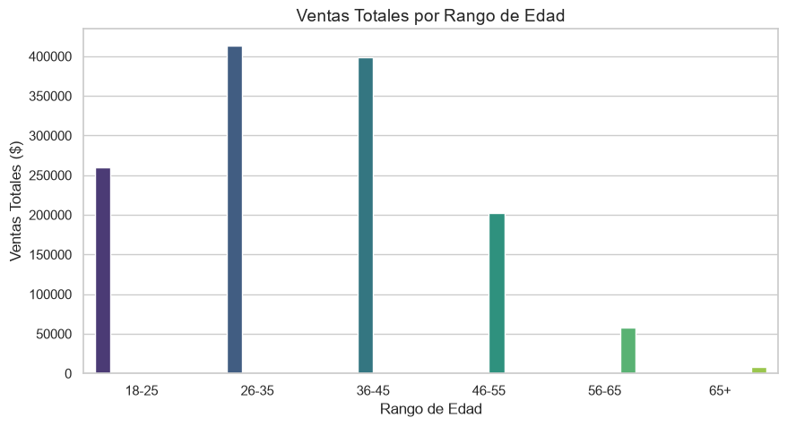
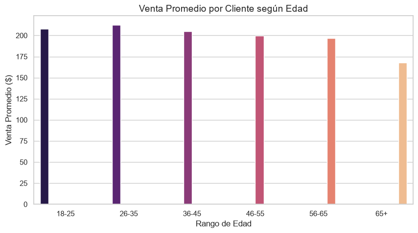
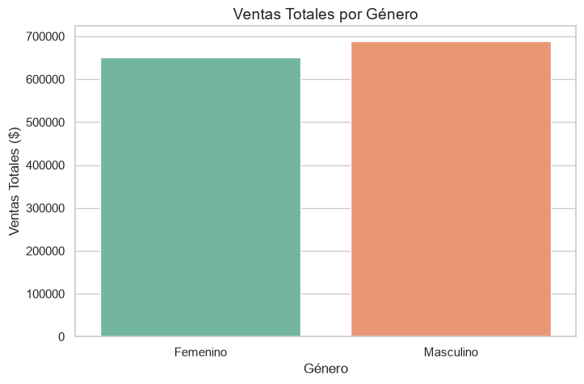
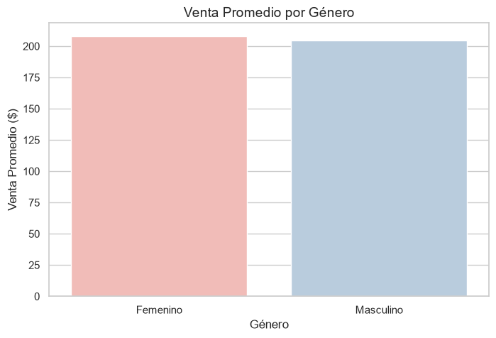
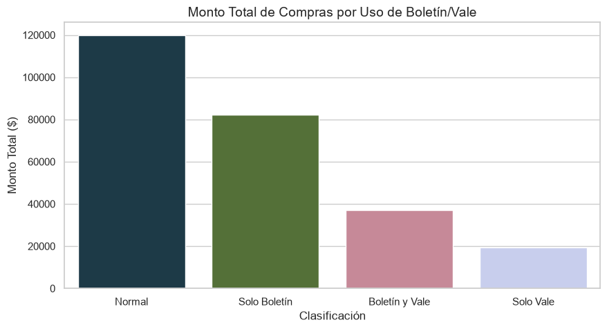
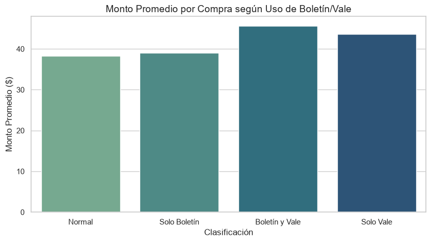

# Documentación Técnica: Segmentación de Clientes (Punto 4)

Este documento detalla la contribución técnica realizada para resolver el inciso 4 (Segmentación de Clientes) y su respectiva integración con el agente de Inteligencia Artificial utilizando MCP y Google ADK.

## Archivos Creados y Modificados

### 1. `app/analisis/punto_04.py` (Nuevo)
**Propósito:** Es el motor lógico y matemático de la segmentación.  
**Explicación del código:**
- Utiliza **Pandas** para procesar los DataFrames que provienen de la base de datos y **Seaborn/Matplotlib** para visualizar los datos.
- Define tres funciones principales: `segmentar_por_edad`, `comportamiento_por_genero` e `impacto_boletines_vales`. 
- Dentro de estas funciones se utiliza `.cut()` para agrupar variables continuas en intervalos (ej. edades), y `.groupby()` encadenado con `.agg()` para calcular promedios, conteos y montos totales con alta eficiencia.
- Se ha incluido el parámetro opcional `graficar: bool`. Si es `True`, el sistema genera las imágenes `png` y las guarda en la ruta indicada, de lo contrario, solo retorna el DataFrame de resultados (útil para la IA).

### 2. `04-Segmentacion-clientes/segmentacion_clientes.ipynb` (Nuevo)
**Propósito:** Interfaz de análisis (Notebook) para presentar los hallazgos y generar las gráficas visuales.
**Explicación del código:**
- El notebook arranca preparando el entorno (compatible con Google Colab y Python local) usando la variable de entorno `.env`.
- Invoca la conexión de solo lectura `obtener_datos(motor)`.
- Ejecuta la función maestra `ejecutar_segmentacion()`, la cual va imprimiendo las tablas (`display()`) mientras dibuja los gráficos de forma dinámica.

### 3. `app/herramientas/punto_04.py` (Nuevo)
**Propósito:** Actuar como puente (wrapper) entre el análisis matemático de Python y el modelo de lenguaje de Gemini.
**Explicación del código:**
- Funciona como una capa de abstracción. Cuando Gemini solicita datos sobre edades o géneros, estas funciones se conectan a PostgreSQL (`_obtener_datos_frescos()`).
- Luego mandan a llamar a las funciones lógicas de `analisis/punto_04.py` pasándoles `graficar=False` para evitar un uso innecesario de recursos.
- Finalmente, toman el resultado y lo convierten a JSON mediante `.to_json(orient="records")` envolviéndolo con meta-información ("nota") para darle contexto a la Inteligencia Artificial de cómo debe interpretar la respuesta (Ej. decirle que 0 es Masculino).

### 4. `app/mcp_server.py` (Modificado)
**Propósito:** Servidor de Herramientas de Inteligencia Artificial.
**Explicación del código:**
- Se importaron las tres nuevas funciones herramientas (`consultar_segmentacion_...`).
- Se expusieron al servidor mediante el decorador `@mcp.tool()`. Esto convierte de manera transparente nuestras funciones de Python en capacidades ejecutables para cualquier agente LLM conectado al puerto 8000.

### 5. `app/ventas_agent/agent.py` (Modificado)
**Propósito:** Modificación de las instrucciones del Agente LLM.
**Explicación del código:**
- Se actualizó el *System Prompt* del `LlmAgent`. 
- En la regla número 10, se le ordenó explícitamente a Gemini que su alcance ahora también abarca el Punto 4 de la práctica y que debe priorizar el uso de las herramientas expuestas (`obtener_segmentacion_edad`, etc.) al responder dudas sobre esos temas en particular, evitando así "alucinaciones".

### 6. `04-Segmentacion-clientes/Preguntas.txt` (Nuevo)
**Propósito:** Archivo auxiliar con comandos *prompt* listos para testear la funcionalidad del Agente AI en un ambiente productivo.

## Anexos: Gráficos de Segmentación
*Nota: Si las imágenes no cargan, asegúrate de haber ejecutado el archivo `segmentacion_clientes.ipynb` para generarlas.*

### Segmentación por Edad

### Comportamiento por Género

### Impacto de Boletines y Vales

