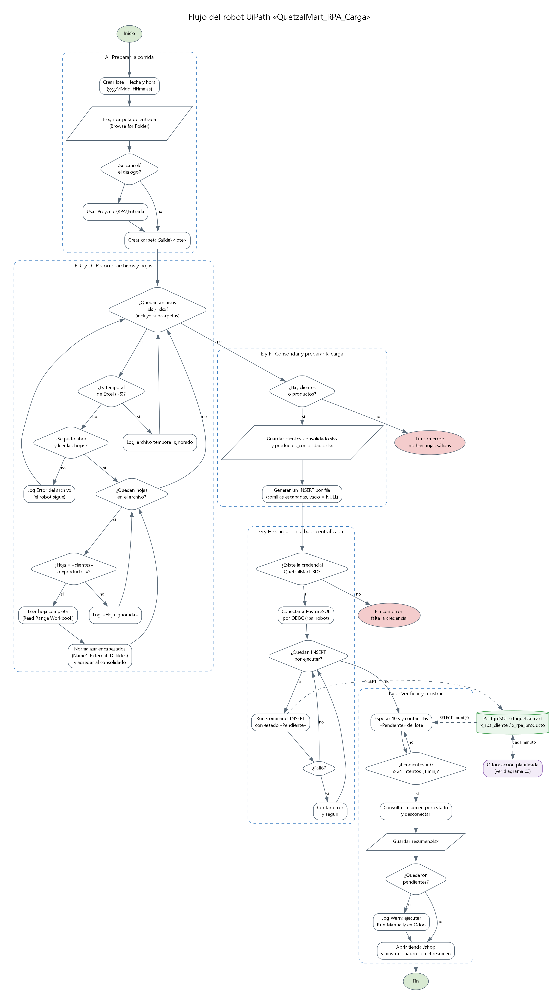
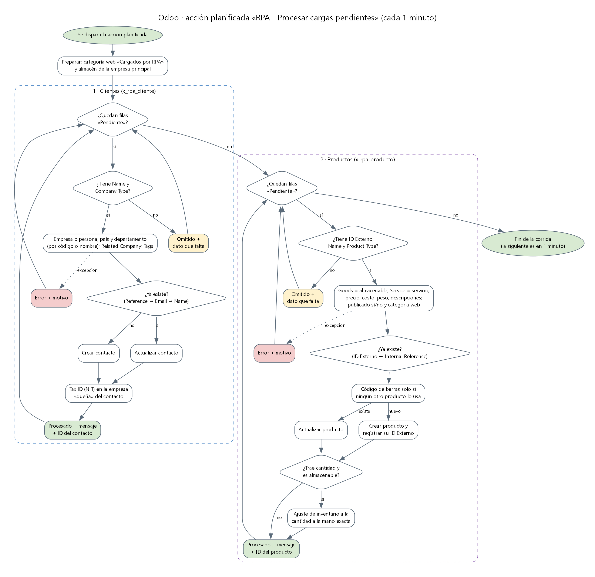

# Manual 2 · Diagramas de flujo del RPA (UiPath)

Proyecto QuetzalMart · SOG2 · Segundo semestre 2026 · Responsable: Angel

Corresponde al punto «Diagrama de flujo de visualización para los incisos realizados con UiPath». Los demás diagramas del Manual 2 (compras, ventas, flujo de la empresa y flujo del cliente web/tienda) se reparten con Madeline.

Los diagramas se generan con Graphviz desde los archivos `.dot` de `diagramas/` (se pueden editar y volver a generar):

```powershell
dot -Tpng -Gdpi=170 01_vista_general.dot -o 01_vista_general.png
```

**Simbología:** óvalo = inicio/fin · rectángulo = proceso · rombo = decisión · paralelogramo = entrada/salida de archivos · cilindro = base de datos · línea punteada = comunicación con la base de datos.

## 1. Vista general

Recorrido de la información desde la carpeta de Excel hasta el sitio web y las consultas SQL.


## 2. Flujo del robot UiPath

Flujo de `Main.xaml`, agrupado en los bloques A a J que se describen en la sección 4 del Manual 1.



## 3. Procesamiento en Odoo

Lo que hace la acción planificada «RPA - Procesar cargas pendientes» con cada fila que insertó el robot.


